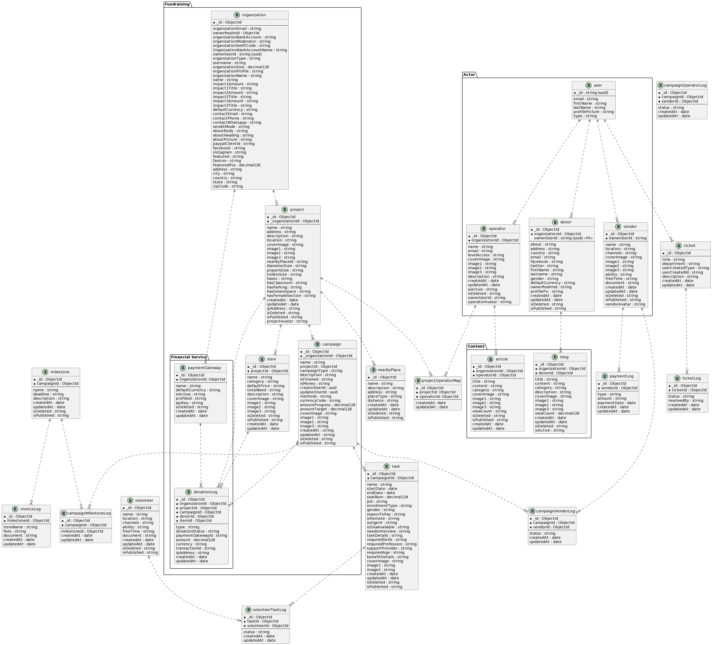

## Set up Project

```bash
yarn
```

## yarn PnP Editor SDK - VS Code

You will get IDE errors in VS Code / Gitpod if you haven't yet set up Yarn PnP Editor SDK.
To set this up:

```bash
yarn dlx @yarnpkg/sdks vscodee
```

Then in your IDE:

1. It may show pop-up to ask permission for Workspace Version, choose Allow.
2. Open any `*.ts` file, press Ctrl+Shift+P, select "TypeScript: Select TypeScript Version..." > "Use Workspace Version".

Reference: https://yarnpkg.com/getting-started/editor-sdks#vscode

## Extensions needed for VS Code / Gitpod

You will need to install the following extensions: (should be prompted automatically)

1. ZipFS
2. Prettier

## How to Trigger CI Deployment to staging or prod environment

First, you **must** push your work to `main` branch first!

Then choose, dev or qc or staging or prod?

To trigger CI for `dev`:

```bash
git push origin main:stack/dev
```

To trigger CI for `qc`:

```bash
git push origin main:stack/qc
```

To trigger CI for `staging`:

```bash
git push origin main:stack/staging
```

To trigger CI for `prod`:

```bash
git push origin main:stack/prod
```

# DB Schema

- [Tmra DB Schema](docs/db_schema_plantuml.md). Generated by plantuml.
  
