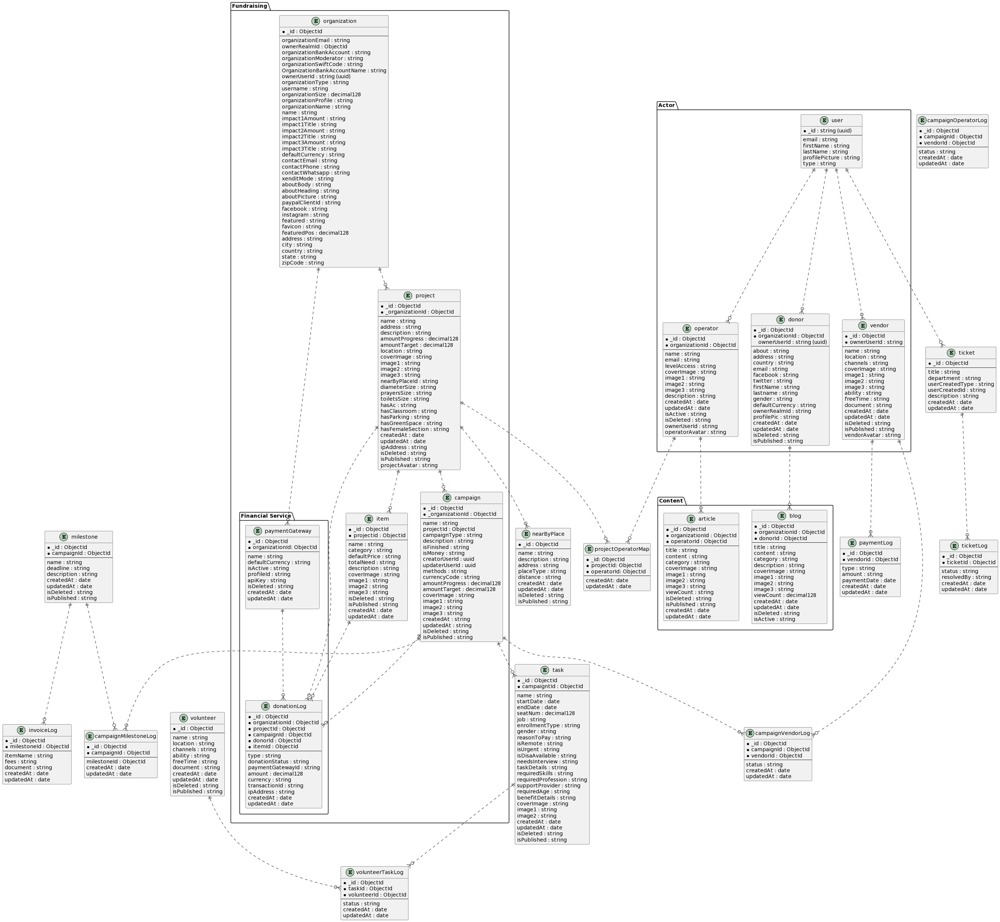

## Set up Project

```bash
yarn
```

## yarn PnP Editor SDK - VS Code

You will get IDE errors in VS Code / Gitpod if you haven't yet set up Yarn PnP Editor SDK.
To set this up:

```bash
yarn dlx @yarnpkg/sdks vscodee
```

Then in your IDE:

1. It may show pop-up to ask permission for Workspace Version, choose Allow.
2. Open any `*.ts` file, press Ctrl+Shift+P, select "TypeScript: Select TypeScript Version..." > "Use Workspace Version".

Reference: https://yarnpkg.com/getting-started/editor-sdks#vscode

## Extensions needed for VS Code / Gitpod

You will need to install the following extensions: (should be prompted automatically)

1. ZipFS
2. Prettier

## How to Trigger CI Deployment to staging or prod environment

First, you **must** push your work to `main` branch first!

Then choose, dev or staging or prod?

Depending on the target environment:

```bash
# Deploy to dev based on latest main branch
yarn deploy:dev
# Deplay staging based on dev (should already be tested)
yarn deploy:staging-from-dev
# Deplay prod based on staging (should already be stable)
yarn deploy:prod-from-staging
```

# DB Schema

- [Tmra DB Schema](docs/db_schema_plantuml.md). Generated by plantuml.
  

\
&nbsp;
\
&nbsp;
\
&nbsp;
\
&nbsp;

# Backend 101

notes:

- Backend repo is located in tmra/apps/raise.
- This repo is using FASTIFY instead of EXPRESS.
- Please use PinoLogger (log/warn/errors), and provide a clear information in the logs.

## Prisma related error

if you get any error regarding prisma, like the code has missing field and so on, you can pull the latest change on the prisma schema
with db pull and generate for the typing

```bash
npx prisma db pull --schema src/prisma/schema.prisma
npx prisma generate --schema src/prisma/schema.prisma
```

\
&nbsp;

# Tender-Management Backend

- Api Docs\
  For example of API Docs can be seen [here](https://www.notion.so/hendyirawan/Messaging-Features-f829245556f0431b980de86e22385413#e6960e6819be4a0d801a112da05bba36), for backend the responsibility is filling the Api Docs, and Entity and Explenations section, Requirement and Story will be created by Project Manager / Product Owner.

- Architecture\
  For tender-management backend the architecture used is Repository Design Pattern, with DTO \
  Concept:
  DTO -> Controller -> Service -> Repository -> Service -> Controller -> DTO -> Response.

- Folder Structure\
  the folder will be splitted by domain (case)\
  ex:\
  (nested) Appointment, contain appointment and schedule.
  (nested) User, contain user, client.
  (single) Email.

  <pre>
  Single Structure
  --- file
  ___ folder
  
  modules_name
  |
  |____ dtos  
  |       |____ requests
  |       |        |---- dto_name.dto.ts
  |       |
  |       |____ responses
  |                |---- dto_name.dto.ts
  |    
  |____ controllers
  |         |---- controller_name.controller.ts
  |
  |____ services
  |         |---- service_name.service.ts
  |
  |____ mappers (optional)
  |         |---- mappername.mapper.ts
  |
  |____ repositories
  |         |---- repository_name.repository.ts
  |
  |---- modules_name.modules.ts
  </pre>

   <pre>
  Nested Structure
  --- file
  ___ folder
  
  tender-user
  |
  |___ client
  |      |
  |      |____ dtos  
  |      |       |____ requests
  |      |       |        |---- dto_name.dto.ts
  |      |       |
  |      |       |____ responses
  |      |                |---- dto_name.dto.ts
  |      |
  |      |____ controllers
  |      |         |---- controller_name.controller.ts
  |      |
  |      |____ services
  |      |         |---- service_name.service.ts
  |      |
  |      |____ mappers (optional)
  |      |         |---- mappername.mapper.ts
  |      |
  |      |____ repositories
  |                |---- repository_name.repository.ts  
  |
  |
  |___ user
  |      |
  |      |____ dtos  
  |      |       |____ requests
  |      |       |        |---- dto_name.dto.ts
  |      |       |
  |      |       |____ responses
  |      |                |---- dto_name.dto.ts
  |      |
  |      |____ controllers
  |      |         |---- controller_name.controller.ts
  |      |
  |      |____ services
  |      |         |---- service_name.service.ts
  |      |
  |      |____ mappers (optional)
  |      |         |---- mappername.mapper.ts
  |      |
  |      |____ repositories
  |                |---- repository_name.repository.ts  
  |
  |---- tender-user.modules.ts
  </pre>

\
&nbsp;
\
&nbsp;

# Tender-Management Backend Architecture Explenations

### DTO (In and Out Payload)

Data Transfer Object, used to validate the payload before it goes to the controller (in), also can be used for building types for the output (out), on this repo we use Class-Validator and Class-Transformer, example for DTO can be seen [here]().

### Controller (Routing)

Used for Routing, connecting endpoint to spesific services, example for Controller can be seen [here]().

### Service (Business Logic / Custom Logic)

Used for business logic / custom logic, ex: uploading files, map object before it goes to the database, etc.., sometimes we seperate the mapping to the mapper, you can see example for the mapper [here](https://gitlab.com/tamrah/tmra/-/blob/main/apps/raise/src/tender-user/user/mappers/update-user.mapper.ts).

example for services can be seen [here](https://gitlab.com/tamrah/tmra/-/blob/main/apps/raise/src/tender-user/user/services/tender-user.service.ts), look at findUsers service, at this service we can see it using custom logic for more deep validation after it passes the dto, and map the response from the databases.

### Repository (DB Operation [Filter and Queries])

Used for filtering, and do queries, also storing / modify the data in databases, we can see the example [here](https://gitlab.com/tamrah/tmra/-/blob/main/apps/raise/src/tender-user/user/repositories/tender-user.repository.ts), look at the findUsers method.
\
&nbsp;
\
&nbsp;

# Tender-Management Backend Libs and Commons Modules

Both of this modules are specials, diffrent from other modules.

### Libs

Containing bunch of NestJS Library configured as @Global decorator that can used trough the other modules, all of the modules are called on "Shared" Modules.

### Commons

Containing Reusable types, utils, etc

- configs:\
  not used for time beings, it will contain how to load .env and validate the env to make sure the .env is exist and has correct types.

- decorators:\
  as it names, it contain decorators, that can be reusable trough out this repo\
  refs:\
  https://docs.nestjs.com/custom-decorators \
  https://docs.nestjs.com/openapi/decorators

- dtos:\
  DTO (Data Transfer Object), this represents the data that in and out from the system (Payload).\
  on this repo we used Class Validator and Class Transformer as an official DTO for NESTJS\
  refs:\
  NESTJS: https://docs.nestjs.com/techniques/validation \
  CLASS-VALIDATOR: https://github.com/typestack/class-validator#readme \
  CLASS-TRANSFORMER: https://github.com/typestack/class-transformer/#readme

- enums

- helpers\
  Function that commonly used for building response / throw errors and etc.

- utils\
  Commonly used funcions.

- interfaces
